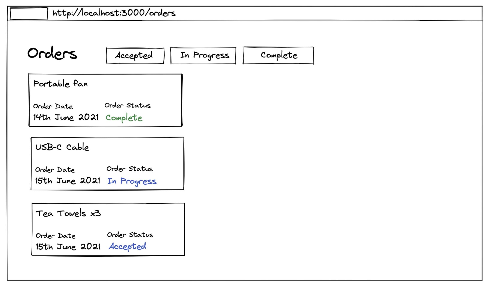

# Orders App Exercise

A small web application created Using TypeScript and React that displays orders. 

Summary:
- On the home page, a button should be displayed that takes me to /orders (nothing else on home page)
- All orders are displayed by default on /orders
- Users can filter by Accepted/In Progress/Complete orders (one at a time)
- When on the orders page, the document's title contains a number that matches the number of orders currently being displayed (e.g. "(12) My Orders")
- The number of currently visible orders are displayed within the page
- Users can jump between Accepted/In Progress/Complete directly
- When users have an order filter on, an "X" button/icon at the top of the list is displayed to dismiss the current filter

Note:

- There is a file with raw JSON for order data. 
- `antd` css library was used in the project
